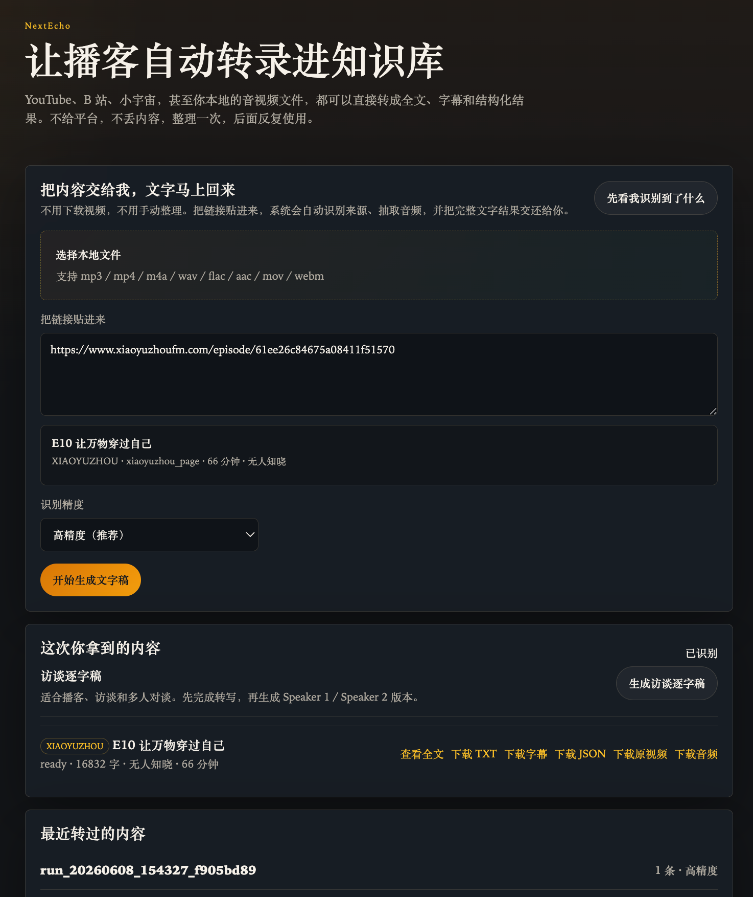

# NextEcho

> 让播客自动转录进知识库

[English README](README.en.md) | [开源合规说明](OPEN_SOURCE_COMPLIANCE.md) | [第三方许可证清单](THIRD_PARTY_LICENSES.md)

NextEcho 是一个本地优先的音视频转写工作台。你可以上传本地文件，或者粘贴 YouTube、B 站、小宇宙、播客 RSS 等链接，把内容转成可复用的文字资产，并落盘为结构化素材包。

它同时适合两类用户：

- 人类用户：直接用网页界面操作
- Agent：通过 CLI 或网页能力接入到工作流里



## 这是什么

NextEcho 适合做这些事：

- 把播客、视频、访谈快速转成全文
- 把一期节目沉淀进你的知识库或笔记系统
- 保留源文件、音频、中间产物和字幕，方便后续复用
- 让 Claude Code、Codex、Cursor Agent 之类工具直接调用本地转录能力

核心特点：

- 本地优先，不依赖云端 ASR
- 支持本地文件和远程链接
- 支持网页端和命令行
- 默认保留 `source.*`、`audio.wav`、`transcript.txt/json/srt/vtt`
- 转录文本默认带项目署名，便于传播时保留来源

## 支持什么输入

- 本地文件：`mp3`、`mp4`、`m4a`、`wav`、`flac`、`aac`、`mov`、`webm`
- 平台页面：YouTube、B 站、小宇宙
- 直链媒体：音频或视频文件 URL
- RSS / 播客 feed

## 推荐用法

如果你是普通用户，推荐只记住这两步，不需要打开终端：

### macOS

1. 双击 `Install NextEcho.command`
2. 安装完成后，双击 `Open NextEcho.command` 或 `dist/NextEcho.app`

### Windows

1. 双击 `Install NextEcho.bat`
2. 安装完成后，双击 `Open NextEcho.bat`

这一套一键脚本会尽量自动完成这些事情：

- 创建 Python 虚拟环境
- 安装 Python 依赖
- 检查并尽量自动安装 `ffmpeg`、`whisper-cli`
- 预下载默认可用模型 `base`
- 自动启动本地网站
- 自动打开浏览器到 `http://127.0.0.1:8765`

## 先安装

### macOS

推荐直接双击：

- `Install NextEcho.command`

它背后实际调用的是：

```bash
bash scripts/install_mac.sh
```

这个脚本会：

- 检查是否安装了 Python 3
- 自动创建 `.venv`
- 安装 `requirements.txt`
- 检查 `ffmpeg` 和 `whisper-cli`
- 如果检测到 Homebrew，自动补装缺失依赖
- 预下载 `base` 模型
- 启动本地网站并自动打开浏览器

如果你想手动安装，最少需要这些依赖：

```bash
python3 -m venv .venv
source .venv/bin/activate
pip install -r requirements.txt
brew install ffmpeg whisper-cpp yt-dlp
python -m workbench.cli doctor
```

### Windows PowerShell

推荐直接双击：

- `Install NextEcho.bat`

它背后调用的是：

```powershell
powershell -ExecutionPolicy Bypass -File scripts\install_windows.ps1
```

如果手动安装，需要确保：

- 已安装 Python 3.10+
- `ffmpeg` 在 PATH 中
- `whisper-cli` 在 PATH 中
- 如果要解析平台页面，建议安装 `yt-dlp`

然后执行：

```powershell
python -m venv .venv
.\.venv\Scripts\Activate.ps1
pip install -r requirements.txt
python -m workbench.cli doctor
```

### 安装完成后先自检

```bash
python -m workbench.cli doctor
```

看到这些就说明主链路基本可用：

- `ffmpeg` 已找到
- `whisper-cli` 已找到
- 至少有一个 Whisper 模型可用，或者允许首次下载

### 模型怎么选

如果你想根据自己电脑的性能手动挑选模型，而不是直接使用默认值，推荐按下面顺序做：

1. 先看当前机器建议：

```bash
python -m workbench.cli doctor
python -m workbench.cli list-models
```

2. 再决定要下载哪个模型：

- `tiny`：最省资源，适合老机器或只想快速预览
- `base`：轻量稳定，适合 8GB 左右机器
- `small`：精度和速度更平衡，适合 8GB 到 16GB 机器
- `medium`：更高精度，适合 16GB 以上机器
- `large-v3-turbo-q5_0`：默认高精度模型，适合性能更强的机器

3. 明确下载你要的模型：

```bash
python -m workbench.cli download-model base
python -m workbench.cli download-model small
python -m workbench.cli download-model large-v3-turbo-q5_0
```

4. 运行转录时，你可以显式指定模型，而不只依赖 `--quality`：

```bash
python -m workbench.cli transcribe /path/to/audio.mp3 --model base --json
python -m workbench.cli transcribe-page "https://www.xiaoyuzhoufm.com/episode/61ee26c84675a08411f51570" --model small --json
```

## 给人类用户怎么用

### 方式一：直接用网页

这是最适合大多数人的方式。

1. 双击 `Open NextEcho.command`（macOS）或 `Open NextEcho.bat`（Windows）
2. 浏览器会自动打开 `http://127.0.0.1:8765`

3. 在网页里任选一种输入方式：

- 上传本地音视频文件
- 粘贴一个或多个链接，每行一个

4. 选择质量：

- `高精度`：默认推荐，优先使用 `large-v3-turbo-q5_0`
- `更快`：速度优先，使用 `base`

5. 点击开始转录，等待生成结果。

网页端适合这些场景：

- 你只是想快速转一期节目
- 你不想碰命令行参数
- 你想直观看到最近的转录记录和产物路径

### 方式二：双击打开 Mac App

如果你在 macOS 上，希望像普通 App 一样启动：

```bash
bash scripts/build_mac_app.sh
```

生成后会得到：

```text
dist/NextEcho.app
```

双击后它会尝试：

- 检查本地环境
- 如果缺依赖，自动调用安装脚本
- 启动服务
- 自动打开 `http://127.0.0.1:8765`

日志写入：

```text
logs/app.log
```

### 方式三：直接用命令行

适合想要批量跑、写脚本、或者把转录结果接进自己工作流的人。

最常用的命令如下。

#### 1. 转录本地文件

```bash
python -m workbench.cli transcribe /path/to/audio.mp3 --quality accurate --json
python -m workbench.cli transcribe /path/to/audio.mp3 --model base --json
```

#### 2. 转录直链媒体

```bash
python -m workbench.cli transcribe "https://example.com/video.mp4" --quality fast
```

#### 3. 先识别来源，再决定是否转录

```bash
python -m workbench.cli resolve-sources "https://www.youtube.com/watch?v=96jN2OCOfLs" --json
python -m workbench.cli resolve-sources "https://www.xiaoyuzhoufm.com/episode/61ee26c84675a08411f51570" --json
```

#### 4. 直接转录平台页面

```bash
python -m workbench.cli transcribe-page "https://www.bilibili.com/video/BV1g6okBLEtL/" --quality fast --json
python -m workbench.cli transcribe-page "https://www.xiaoyuzhoufm.com/episode/61ee26c84675a08411f51570" --quality accurate --json
python -m workbench.cli transcribe-page "https://www.xiaoyuzhoufm.com/episode/61ee26c84675a08411f51570" --model small --json
```

#### 5. 转录播客 RSS

```bash
python -m workbench.cli transcribe-feed "https://example.com/feed.xml" --limit 3 --quality fast --json
```

#### 6. 查看当前机器适合哪些模型

```bash
python -m workbench.cli list-models
python -m workbench.cli list-models --json
```

#### 7. 提前下载指定模型

```bash
python -m workbench.cli download-model base
python -m workbench.cli download-model large-v3-turbo-q5_0
```

## 给 Agent 怎么用

NextEcho 既可以给 Agent 走命令行，也可以让 Agent 启动网页给用户操作。

### 方式一：让 Agent 走 CLI

这是最稳的接法。把仓库给 Agent 后，让它读取：

```text
AGENT_INSTALL.md
```

推荐对 Agent 说：

> 请按 AGENT_INSTALL.md 安装 NextEcho，并验证网页端和 CLI 都能使用。

当 Agent 通过 CLI 工作时，常见调用方式如下。

#### 1. 让 Agent 先做环境检查

```bash
python -m workbench.cli doctor
python -m workbench.cli doctor --json
python -m workbench.cli list-models --json
```

#### 2. 让 Agent 转录一个本地文件或直链

```bash
python -m workbench.cli transcribe /path/to/audio.mp3 --quality accurate --json
python -m workbench.cli transcribe "https://example.com/video.mp4" --quality accurate --json
python -m workbench.cli transcribe /path/to/audio.mp3 --model base --json
```

#### 3. 让 Agent 先解析平台页面

```bash
python -m workbench.cli resolve-sources "https://www.xiaoyuzhoufm.com/episode/61ee26c84675a08411f51570" --json
```

#### 4. 让 Agent 直接跑平台链接

```bash
python -m workbench.cli transcribe-page "https://www.youtube.com/watch?v=96jN2OCOfLs" --quality accurate --json
python -m workbench.cli transcribe-page "https://www.xiaoyuzhoufm.com/episode/61ee26c84675a08411f51570" --quality accurate --json
python -m workbench.cli transcribe-page "https://www.xiaoyuzhoufm.com/episode/61ee26c84675a08411f51570" --model small --json
```

#### 5. 让 Agent 处理 RSS feed

```bash
python -m workbench.cli transcribe-feed "https://example.com/feed.xml" --limit 3 --quality fast --json
```

Agent 工作时建议遵循这套顺序：

1. 先跑 `doctor`
2. 再跑 `list-models`，根据用户机器选择 `tiny / base / small / medium / large-v3-turbo-q5_0`
3. 如果需要，先执行 `download-model <model>`
4. 如果输入是平台链接，先跑 `resolve-sources`
5. 再决定是 `transcribe`、`transcribe-page` 还是 `transcribe-feed`
6. 先读取 `manifest.json`，再读取每个 item 下的 `metadata.json` 和 `transcript.txt`

### 方式二：让 Agent 启动网页给用户操作

如果用户更习惯可视化操作，可以让 Agent 直接启动：

```bash
python -m workbench.cli serve
```

然后让用户打开：

```text
http://127.0.0.1:8765
```

这种方式适合：

- 用户要自己粘链接和上传文件
- Agent 只负责搭环境和打开入口
- 用户想人工检查最终结果

## 访谈逐字稿怎么用

如果你希望输出 `Speaker 1 / Speaker 2` 形式的访谈逐字稿，需要额外准备说话人分离依赖。

### 轻量本地 fallback

如果你不想配置 Hugging Face token，可以先装：

```bash
pip install -r requirements-speakers-lite.txt
```

这会启用 `segment-clustering` 后端，适合先跑通流程。

### 更稳的 pyannote 主方案

如果你要更强的 speaker diarization，再装：

```bash
pip install -r requirements-speakers.txt
```

然后设置：

```bash
export HF_TOKEN=your_token_here
```

PowerShell：

```powershell
$env:HF_TOKEN="your_token_here"
```

### 使用命令

#### 1. 直接从音频生成访谈逐字稿

```bash
python -m workbench.cli speaker-transcript /path/to/audio.wav --quality accurate --json
python -m workbench.cli speaker-transcript /path/to/audio.wav --model base --json
```

#### 2. 从已有单条转录结果继续生成

```bash
python -m workbench.cli speaker-transcript /path/to/run_xxx
```

程序会输出：

- `transcript.speakers.json`
- `transcript.speakers.txt`
- `transcript.speakers.md`
- `speaker_map.json`

## 产物会输出到哪里

每次运行都会生成一个 `run_xxx/` 目录，结构如下：

```text
outputs/transcriptions/run_xxx/
├── manifest.json
├── run_config.json
└── items/
    └── 001_<source_label>/
        ├── metadata.json
        ├── source.<ext>
        ├── audio.wav
        ├── transcript.txt
        ├── transcript.json
        ├── transcript.srt
        └── transcript.vtt
```

如果生成了访谈逐字稿，通常还会在 run 根目录看到：

- `transcript.speakers.json`
- `transcript.speakers.txt`
- `transcript.speakers.md`
- `speaker_map.json`

## 模型复用

如果你已经有 Whisper 模型，不必重复下载，可以直接复用：

```bash
export TRANSCRIBE_MODEL_DIR=/path/to/your/whisper-models
```

PowerShell：

```powershell
$env:TRANSCRIBE_MODEL_DIR="C:\path\to\your\whisper-models"
```

程序会优先查找：

- 显式模型路径
- `TRANSCRIBE_MODEL_DIR`
- `WHISPER_MODEL_DIR`
- 项目本地模型目录

如果都没有，首次运行时才会自动下载。

## 关于 token 和成本

- 转录计算在本地完成，不调用云端 LLM 或云端 ASR
- 音视频解析本身不消耗 LLM token
- 如果通过 Agent 发起任务，Agent 在理解指令、运行命令、读取结果时，仍会消耗少量编排 token
- 如果采用 pyannote，首次模型下载可能需要 Hugging Face token，但这不是 LLM/API 计费

## 开源与合规

为了让仓库公开发布时更规范，仓库里已经补充了这些文档：

- [OPEN_SOURCE_COMPLIANCE.md](OPEN_SOURCE_COMPLIANCE.md)：开源发布前的合规结论、风险说明、发布策略
- [THIRD_PARTY_LICENSES.md](THIRD_PARTY_LICENSES.md)：第三方依赖与许可证清单
- `NOTICE`：第三方组件与商标声明

当前仓库 License：

- `AGPL-3.0`

这意味着：

- 任何人都可以使用、修改和分发本项目
- 如果别人修改后再对外提供网络服务，也需要按 AGPL 的要求公开对应源码
